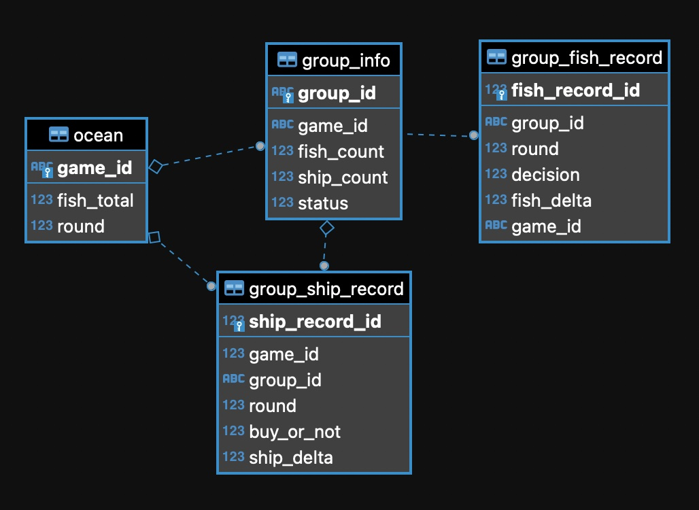
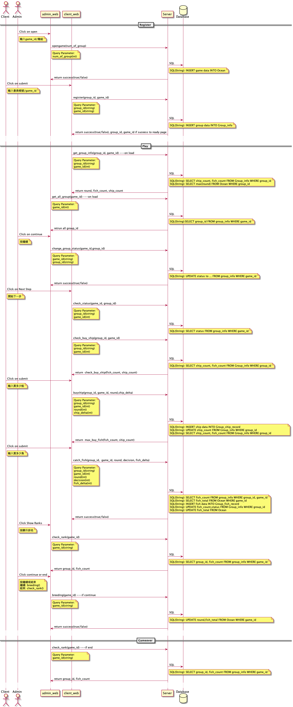

# 110-1 JavaScript期末專題-捕魚遊戲

專案repo：https://github.com/jimmyfu87/gameFishing

## 作者與分工

+ 遊戲美術及音效設計：唐思琪
+ 前端工程師：魏千芃、李昀儒
+ 後端工程師與文件開發：唐思琪、柯炯名、傅俊益、簡佑臻
+ 資料庫架構：柯炯名
+ 系統分析架構：傅俊益

## Demo影片

## UI設計

  
[View in detail](https://www.figma.com/file/czCga8mpyHjVzSrr3uTFmP/gamefishing?node-id=306%3A8932)

## Database ERD

  

## API 
  
